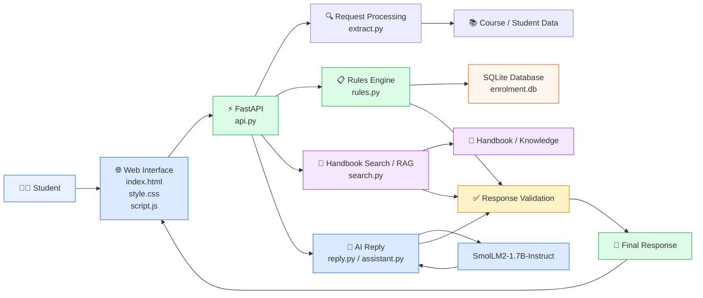
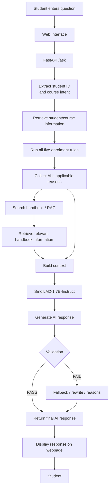
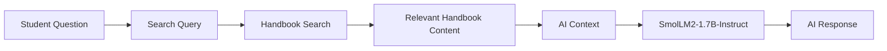
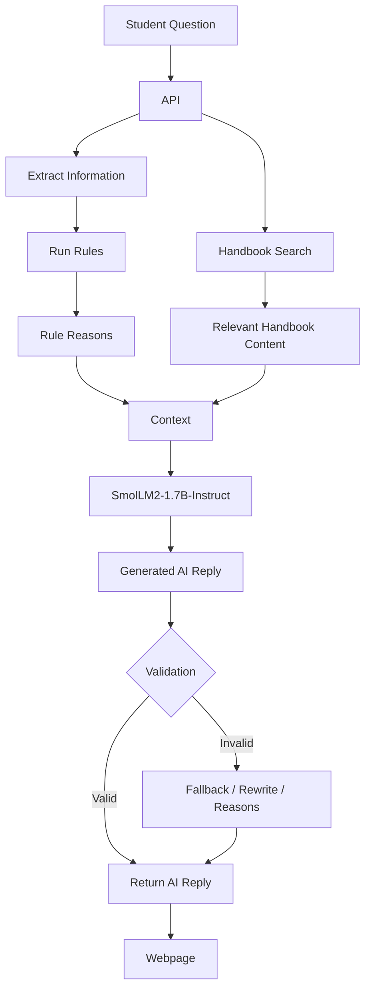

# 🎓 Course Enrolment Assistant

An AI-powered **Course Enrolment Assistant** that helps students understand course eligibility, enrolment restrictions, prerequisites, fees, credit limits, timetable clashes, and handbook requirements.

The system combines:

- **FastAPI** for the backend API
- **HTML, CSS and JavaScript** for the web interface
- **SQLite** for student, course and enrolment data
- **Python rule-based validation** for deterministic enrolment decisions
- **RAG / handbook search** for retrieving relevant policy information
- **SmolLM2-1.7B-Instruct** for natural-language AI responses

The system evaluates **all applicable enrolment rules**, rather than stopping at the first failed rule.

---

# 📌 Project Overview

Students often need to know whether they are eligible to enrol in a particular course and, if not, why their enrolment is blocked.

Instead of manually checking multiple academic rules and handbook pages, this application provides one interface where a student can:

1. Search for their student record.
2. View their fee status.
3. View their current and completed enrolments.
4. Browse available courses.
5. Check eligibility for a course.
6. See every applicable enrolment reason.
7. Ask a natural-language question using **Ask AI**.
8. Receive an AI-generated explanation based on the rule results and handbook information.


# 🏗️ System Architecture



---

# 🔄 End-to-End Data Flow



---

# 🧩 Project Layers

| Layer | Component | Responsibility |
|---|---|---|
| UI Layer | `index.html` | Webpage structure |
| UI Layer | `style.css` | Webpage styling |
| UI Layer | `script.js` | API communication and UI actions |
| API Layer | `api.py` | FastAPI endpoints |
| Rule Layer | `rules.py` | Course enrolment eligibility rules |
| AI Layer | `reply.py` | AI response generation |
| AI Layer | `assistant.py` | Assistant / response processing |
| Extraction | `extract.py` | Extract useful information from requests |
| Search / RAG | `search.py` | Handbook / knowledge retrieval |
| Database | `enrolment.db` | Student, course and enrolment data |
| Data | `data/` | Project input/reference data |
| Results | `*_results.json` | Task/test outputs |

---

# 🛠️ Technology Stack

| Technology | Purpose |
|---|---|
| Python | Core application logic |
| FastAPI | REST API backend |
| Uvicorn | API server |
| HTML | Frontend structure |
| CSS | Frontend styling |
| JavaScript | Frontend/API integration |
| SQLite | Database |
| RAG | Handbook information retrieval |
| SmolLM2-1.7B-Instruct | AI response generation |
| Git | Version control |
| GitHub | Source-code repository |

---

# 📂 Project Structure

```text
course_enrollment_assistant/
│
├── api.py
├── assistant.py
├── check_data.py
├── comparison.py
├── extract.py
├── load.py
├── reply.py
├── rules.py
├── search.py
│
├── index.html
├── script.js
├── style.css
│
├── data/
│
├── enrolment.db
│
├── extract_results.json
├── task8_results.json
├── task9_results.json
│
├── README.md
└── .gitignore
```

---

# ⚡ How the System Works

## 1. Student Question

The student enters a natural-language question.

Example:

```text
Why can't I enrol in Machine Learning?
```

The question is sent from the webpage to the FastAPI backend.

---

## 2. Request Processing

The backend receives the request and identifies information such as:

- Student ID
- Course
- User intent
- Relevant keywords

The extraction functionality is handled by:

```text
extract.py
```

---

## 3. Student and Course Lookup

The application retrieves information from:

```text
enrolment.db
```

The system can obtain:

- Student details
- Fee status
- Programme information
- Completed courses
- Current enrolments
- Course information
- Prerequisites
- Course capacity

---

# 📋 Enrolment Rules

The rule engine is implemented in:

```text
rules.py
```

The system checks the applicable enrolment conditions.

Examples include:

| Rule | Example |
|---|---|
| Fees | Student has unpaid fees |
| Prerequisites | Required course/grade not completed |
| Capacity | Course is already full |
| Credit limit | Student would exceed maximum credits |
| Timetable clash | Course conflicts with another enrolment |

### Important Design Decision

The system does **not** stop at the first failure.

It evaluates all relevant rules and returns every applicable reason.

For example:

```text
Student: S-102
Course: CS301
```

The result can contain:

```text
- fees are unpaid
- would be 65 credits, limit 60
```

Both reasons are returned to the student.

---

# 🔎 RAG / Handbook Search

The project uses handbook information to provide additional context for AI responses.

The search functionality is handled through:

```text
search.py
```

The simplified RAG process is:



The retrieved information helps the AI response remain grounded in the available course and enrolment guidance.

---

# 🤖 Ask AI

The **Ask AI** feature allows a student to ask an enrolment question using natural language.

Example:

```text
Student ID:
S-102

Question:
Why can't I enrol in Machine Learning?
```

The system processes the request and generates an answer based on the rule results and available handbook information.

Example output:

```text
Enrolment is blocked because:

1. Fees are unpaid.
2. Enrolling in CS301 would result in 65 credits,
   exceeding the 60-credit limit.
```

---

# 🧠 AI Response Flow



---

# 🌐 API Endpoints

The FastAPI backend exposes endpoints for the main application functions.

| Endpoint | Method | Purpose |
|---|---|---|
| `/` | GET | Main webpage |
| `/students/{student_id}` | GET | Get student information |
| `/students/{student_id}/enrolments` | GET | Get student enrolments |
| `/courses` | GET | Get all courses |
| `/courses/{course_code}` | GET | Get individual course |
| `/check/{student_id}/{course_code}` | GET | Check enrolment eligibility |
| `/requests/{request_id}` | GET | Get student request |
| `/ask` | GET | Ask AI question |

> The exact endpoint list should match the current `api.py` committed to this repository.

---

# 🧪 Test Cases

The project was tested against six student requests.

| Request | Student | Course | Expected Result |
|---|---|---|---|
| R1 | S-104 | CS201 | Enrolment blocked |
| R2 | S-101 | CS310 | Enrolment blocked |
| R3 | S-103 | CS202 | Enrolment blocked |
| R4 | S-102 | CS301 | Two reasons |
| R5 | S-105 | CS301 | Enrolment blocked |
| R6 | S-106 | DS220 | Approval |

---

# ✅ Important Test: R4

R4 verifies that the system returns **both applicable reasons**.

### Input

```text
Student ID: S-102
Course: CS301
```

### Expected reasons

```text
fees are unpaid
would be 65 credits, limit 60
```

### Expected response

```text
Enrolment is blocked because:

- fees are unpaid
- would be 65 credits, limit 60
```

This confirms that the rules engine evaluates multiple conditions instead of returning only the first failure.

---

# 🧪 Natural Language Test Prompts

| ID | Prompt |
|---|---|
| R1 | `I want to take Algorithms this term.` |
| R2 | `Can I add Distributed Systems?` |
| R3 | `I would like to join Databases please.` |
| R4 | `Trying to sign up for Machine Learning and it will not let me.` |
| R5 | `Machine Learning please, I have done everything it asks for.` |
| R6 | `Could I take Data Visualisation?` |

---

# 📊 Expected Test Results

| Request | Course | Rule Check | AI Reply | Result |
|---|---|---|---|---|
| R1 | CS201 | PASS | PASS | ✅ |
| R2 | CS310 | PASS | PASS | ✅ |
| R3 | CS202 | PASS | PASS | ✅ |
| R4 | CS301 | PASS | PASS | ✅ |
| R5 | CS301 | PASS | PASS | ✅ |
| R6 | DS220 | PASS | PASS | ✅ |

### Overall

```text
6 / 6 requests passed
```

---

# 🚀 Running the Application

## 1. Open the project directory

```bash
cd course_enrollment_assistant
```

## 2. Start FastAPI

```bash
uvicorn api:app --reload
```

The server should start at:

```text
http://127.0.0.1:8000
```

## 3. Open the Web Application

Open:

```text
http://127.0.0.1:8000/
```

## 4. Open FastAPI Documentation

```text
http://127.0.0.1:8000/docs
```

---

# 🔧 Example API Requests

### Get Student

```text
GET /students/S-102
```

### Get Enrolments

```text
GET /students/S-102/enrolments
```

### Get Courses

```text
GET /courses
```

### Get Course

```text
GET /courses/CS301
```

### Check Enrolment

```text
GET /check/S-102/CS301
```

### Ask AI

```text
GET /ask?student_id=S-102&message=Why%20can't%20I%20enrol%20in%20Machine%20Learning?
```

---

# 🔐 Error Handling

The application handles common errors without displaying raw error traces to students.

Examples:

### Unknown Student

Instead of displaying an error trace:

```text
Student not found
```

### Invalid Course

```text
Course not found
```

### Invalid Enrolment

```text
Enrolment could not be checked.
```

### AI Failure

The application can fall back to the deterministic rule reasons if the AI response fails validation.

---

# 🛡️ AI Response Validation

The AI response is not treated as the source of truth for enrolment eligibility.

The decision is grounded in:

```text
Student Data
      +
Course Data
      +
Enrolment Rules
      +
Handbook Information
      ↓
AI Response
      ↓
Validation
      ↓
Final Response
```

This approach reduces the risk of the language model inventing an enrolment reason.

---

# 🎯 Key Features

| Feature | Status |
|---|---|
| Student lookup | ✅ |
| Fee status | ✅ |
| Student enrolments | ✅ |
| Course listing | ✅ |
| Course details | ✅ |
| Course capacity | ✅ |
| Prerequisite checking | ✅ |
| Credit-limit checking | ✅ |
| Fee checking | ✅ |
| Timetable-clash checking | ✅ |
| Multiple-rule validation | ✅ |
| Handbook retrieval | ✅ |
| RAG-based context | ✅ |
| Ask AI | ✅ |
| AI response validation | ✅ |
| HTML/CSS/JS interface | ✅ |
| FastAPI backend | ✅ |
| SQLite database | ✅ |

---

# 📈 Why This Architecture?

The project separates **deterministic business rules** from **AI-generated language**.

```text
                COURSE ENROLMENT ASSISTANT

             ┌──────────────────────┐
             │      Student         │
             └──────────┬───────────┘
                        │
                        ▼
             ┌──────────────────────┐
             │  Web Interface       │
             │ HTML / CSS / JS      │
             └──────────┬───────────┘
                        │
                        ▼
             ┌──────────────────────┐
             │      FastAPI         │
             │      api.py          │
             └──────┬───────┬───────┘
                    │       │
          ┌─────────┘       └──────────┐
          ▼                            ▼
 ┌──────────────────┐        ┌──────────────────┐
 │ Rules Engine     │        │ Handbook Search  │
 │ rules.py         │        │ search.py        │
 └────────┬─────────┘        └────────┬─────────┘
          │                            │
          ▼                            ▼
 ┌──────────────────┐        ┌──────────────────┐
 │ SQLite Database  │        │ RAG Context      │
 │ enrolment.db     │        │ Handbook Data    │
 └────────┬─────────┘        └────────┬─────────┘
          │                            │
          └────────────┬───────────────┘
                       ▼
              ┌──────────────────┐
              │ AI Reply         │
              │ SmolLM2          │
              │ reply.py         │
              └────────┬─────────┘
                       │
                       ▼
              ┌──────────────────┐
              │ Response         │
              │ Validation       │
              └────────┬─────────┘
                       │
                       ▼
              ┌──────────────────┐
              │ Final Response   │
              │ → Student        │
              └──────────────────┘
```

---

# 💡 Design Principle

The most important design principle is:

> **Rules decide. AI explains.**

The Python rules engine determines whether the student can enrol.

The AI layer converts the verified information into a clear, natural-language explanation.

This keeps the system both **useful and explainable**.

---

# 📌 Project Outcome

The Course Enrolment Assistant successfully combines:

```text
Web Interface
      ↓
FastAPI
      ↓
Data Extraction
      ↓
SQLite Student/Course Data
      ↓
Rule-Based Eligibility Checking
      ↓
Handbook / RAG Retrieval
      ↓
SmolLM2-1.7B-Instruct
      ↓
AI Response
      ↓
Validation
      ↓
Final Student Response
```

The six defined student scenarios were tested, including the important case where **S-102 checking CS301 returns two independent enrolment reasons**.

---

# 👨‍💻 Author

**Akshay Chindam**

Course Enrolment Assistant — AI / RAG / FastAPI Project

---

# 📄 License

This project is intended for educational and demonstration purposes.
